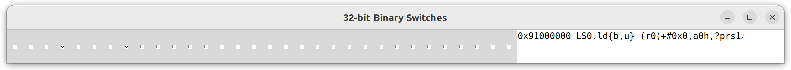

# DSP instruction decoding 
Discovering how instructions are encoded is fundamental to building a disassembler/assembler for the architecture. Unluckily, there's no information about this other than the huge lookup table we've created in [`t32_insn_bruteforce`](https://github.com/fxsheep/seewa-eks/tree/main/info/t32_insn_bruteforce), so we'll have to manually discover encodings from it.

## Instruction class
After a brief comparison in `insn_16.txt`, it turns out that the encoding is a mess.
I've tried 4 and 5 leading bits as instruction opcode field, neither worked - opcode determination seems to be split into multiple parts, there's 4 leading bits deciding (roughly) the 'class' of instruction, i.e. which particular execution unit this insn for, then the specific op is decided by latter fields, and they're different per class.
 - Leading 4bit field -> instruction class
```
0000 SC : 16
0001 A.S : 16?
0010 A.L : 16?
0011 SQ : 16
 0x3DXX sequencer: VLIW slots combining?
0100 LS0 : 16
0101 LS0 : 16
0110 M0 : 16?
0111 M0 : 16?
1000 LS0
1001 LS0
1010 LS1
1011 LS1
1100 LS0 || SC
 0xC800 A.M0 || SC
 0cCA00 A.M1 || SC
 0xCC00 A.S || SC
 0xCE00 A.L || SC
1101 LS0 + (SC?)
1110 LS1 || SC
1111 LS1 || SC

```
It seems that starting from `1000` the list looks quite messy, and my best bet is that the top bit either ~enables some more complicated VLIW encoding~ or indicates 32bit instrcutions.

## 16bit instrcution encoding
TODO

## 32bit instruction encoding
We've found that the 1st(leftmost) bit enables 32bit coding, what's next? Somehow I ran into this:
```
1001 9C800000 SQ.dint
1011 BC800000 SQ.dint
1101 DC8000000000 SQ.dint || SC.cmps{eq} r0,#0x0,prs0
1111 FC8000000000 SQ.dint || SC.cmps{eq} r0,#0x0,prs0
```
It looks that the 2nd bit enables VLIW slot combining. So I tried the following:
```
DC8000003CA0 SQ.dint || SQ.nop
DC800000DC8000000000 SQ.dint || SQ.dint || SC.cmps{eq} r0,#0x0,prs0
```
Indeed it does. By setting the 2nd bit, it tells the DSP to execute the next instruction in the same cycle as current one - combining them into a VLIW insn.

## Encoding visualization
`insn_visualier.py` and `insn_visualier_32b.py` are simple visualization scripts:




By ticking a checkbox, a corresponding bit (ordered in high to low) will be set to 1, then a 16(or 32) bit machine code is formed and the corresponding disassembly is displayed. By toggling instruction bits, the difference in disassembly is apparantly shown, allowing easy decoding of machine code format.

 - Note that due to space constraints, the 32bit visualizer is based on the dataset `insn_32_0x100.txt.xz`, thus the most 2 bits are always `10`, least 8 bits are always set to 0, regardless of selected value.
 - Due to inline decompression, the 32bit visualizer can be significantly slower.
